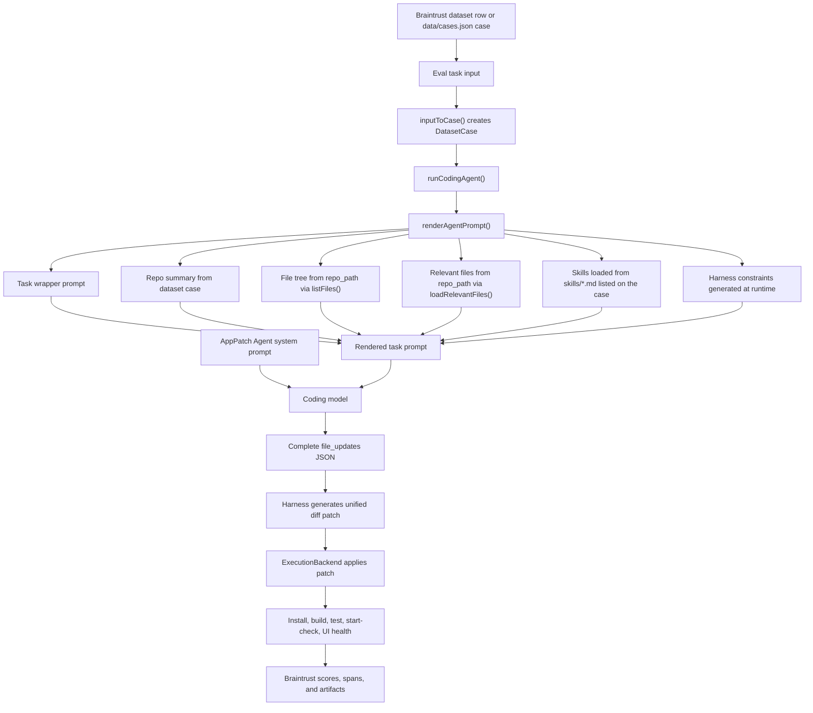

# Coding Agent One-Shot Eval Demo

This repo is a minimal, practical demo of an enterprise coding-agent eval workflow. The initial optimization goal is explicit: can a coding agent one-shot a runnable application from a prompt plus a repo SHA, with no manual repair?

1. Input: a user prompt plus a repo state / commit SHA fixture.
2. Agent output: a code patch on top of that starting repo state.
3. Scorer: a custom execution backend applies the patch, installs deps, builds, tests, starts the app, and inspects basic UI health.
4. Braintrust: one experiment row per dataset case, with deterministic scores, trace metadata, patch artifacts, duration, and estimated cost placeholders.

The headline score is `OneShotRunnableApp`. It is a deterministic composite that only passes when the patch applies to the requested repo state, dependencies install, the app builds, tests pass, the app starts, basic UI health passes, and the agent trace is complete. The supporting scores remain visible so teams can diagnose exactly where a one-shot attempt failed.

The important architectural point is that Braintrust does not need to execute the target app itself. The scorer owns execution. In this local demo, `LocalExecutionBackend` runs commands in a temp directory. In a remote deployment, `RemoteExecutionBackend` is where private infrastructure would receive the patch, run the real harness, and report metrics back.

## Quick Start

```bash
npm install
npm run demo
```

`npm run demo` uses canned patch outputs so the full eval loop works without an LLM key.
For live-demo speed, the local scorer links the root `node_modules` into each temp repo instead of running a fresh network install every time. Set `ONE_SHOT_DEMO_FAST_INSTALL=0 npm run demo` to force real per-temp `npm install` behavior.

To run with a real coding model and log to Braintrust:

```bash
cp .env.example .env
export OPENAI_API_KEY=...
export BRAINTRUST_API_KEY=...
npm run eval
```

If `BRAINTRUST_API_KEY` is set, `src/eval.ts` runs the Braintrust eval in the `coding-agent-one-shot-demo` project by default. If it is not set, it runs the same execution loop locally and prints JSON summaries.

The default real model is `gpt-5.2-codex`, because this demo is evaluating a coding agent that must produce patches against a repo state. You can override it with `CODING_AGENT_MODEL=gpt-4.1` or another model. Codex-family models use the Responses API; older chat models use Chat Completions.

You can also point the runner at an existing env file without copying secrets:

```bash
npm run eval:real -- --env-file=/absolute/path/to/.env
```

`npm run eval:real` runs only the first inventory case, which is a better smoke test for a real model-backed eval. `npm run eval` runs the full dataset.

To load the same keys but print local score JSON instead of logging to Braintrust:

```bash
npm run eval:real -- --env-file=/absolute/path/to/.env --local
```

To run the execution backend on Modal instead of the local temp directory:

```bash
modal deploy modal/scorer.py
ONE_SHOT_EXECUTION_BACKEND=modal \
MODAL_SCORER_URL=https://your-modal-url \
npm run eval:real -- --env-file=/absolute/path/to/.env
```

The Modal scorer clones `repo_url`, checks out `repo_commit_sha`, applies the generated patch, runs the configured commands, inspects built UI assets, and returns the same `ExecutionReport` shape as the local backend.

To run only the coding agent ad hoc and save its patch JSON locally:

```bash
npm run agent:real -- --case=inventory-dashboard-001 --env-file=/absolute/path/to/.env
```

The default output is `results/<case-id>.agent-result.json`; pass `--out=results/custom.json` to choose another path.

To seed real Braintrust traces for Topics:

```bash
npm run seed:traces -- --count=10 --env-file=/absolute/path/to/.env
```

The seeder cycles through the dataset cases until it reaches `--count`, so the same command can later run `--count=500`.

Each Braintrust eval row attaches three proof artifacts:

- `applied.patch`: exact patch generated by the harness.
- `execution-report.json`: repo SHA, files changed, command outputs, exit codes, durations, UI health, scores, and token/cost metrics.
- `runnable-app.tar.gz`: the patched app repo after execution, excluding `node_modules` and `.git`, including the built `dist` directory when build succeeds.

The trace also includes command-level spans for patch application, install, build, tests, start check, and UI health.

For a crisp demo, lead with the inventory case and the `OneShotRunnableApp` score, then drill into the command spans and attached proof artifacts to show that the result was actually executed. If someone wants to run the generated app locally, download `runnable-app.tar.gz`, extract it, run `npm install`, then `npm run dev`.

Each score also logs explanation metadata. For example, `OneShotRunnableApp` includes the full pass/fail checklist, command-backed scores include command, exit code, duration, and stdout/stderr excerpts, and `BasicUIHealth` includes matched UI terms and inspected built files.

## What Is Included

- `fixtures/inventory-app`: a tiny Vite React app fixture that starts as a placeholder page.
- `data/cases.json`: twelve app-builder dataset cases shaped like the requested input.
- `prompts/system.md`: the coding-agent system prompt.
- `prompts/task-wrapper.md`: the task wrapper prompt.
- `skills/*.md`: optional skill files passed to the agent.
- `src/agent/mock-templates.ts`: deterministic mock agent outputs for local demo runs.
- `src/agent/run-agent.ts`: renders the prompt, calls a coding model for complete file updates, and converts those updates into a deterministic patch.
- `src/backends/execution-backend.ts`: local and remote scorer backend interfaces.
- `src/eval.ts`: Braintrust eval entrypoint and local fallback runner.

## Architecture

The coding agent is intentionally simple: dataset rows describe the requested app and repo state, the harness expands that row into a concrete task prompt, the model returns complete file updates, and the harness turns those updates into a patch that can be executed and scored.



### Prompt Field Provenance

The editable `task_wrapper_prompt` uses plain placeholders such as `{{user_request}}`, not `{{input.user_request}}`, because this repo renders the wrapper itself in `src/agent/run-agent.ts`.

| Placeholder | Source |
| --- | --- |
| `{{user_request}}` | `DatasetCase.user_request`, usually from `data/cases.json` or a Braintrust dataset row `input.user_request` |
| `{{repo_summary}}` | `DatasetCase.repo_summary`, written into each case as a short human description of the fixture |
| `{{file_tree}}` | Generated by walking `DatasetCase.repo_path` with `listFiles()` |
| `{{relevant_files}}` | Generated by `loadRelevantFiles()` from the fixture repo, currently focused on package, source, style, test, and config files |
| `{{test_commands}}` | `DatasetCase.test_commands`, joined into newline-separated commands |
| `{{available_skills}}` | Contents of the files named in `DatasetCase.skills`, loaded from `skills/` |
| `{{constraints}}` | Runtime harness constraints generated in `renderAgentPrompt()`, including patch/file-update rules and the starting repo SHA |

The `app_patch_agent_prompt` is the system prompt that defines the agent's standing behavior. The `task_wrapper_prompt` is the per-case work-order template. In most demos, tune the system prompt or `implementation_guidance` first; expose the wrapper to show that the whole harness prompt is parameterized.

### Adding And Testing A Skill

A skill is just a Markdown guidance file in `skills/` plus a reference to that file in one or more dataset cases.

1. Add a file such as `skills/enterprise-ui-density.md`.
2. Add the filename to the relevant case's `skills` array in `data/cases.json`.
3. Run `npm run agent:real -- --case=inventory-dashboard-001 --env-file=/absolute/path/to/.env` to inspect whether the generated patch reflects the new skill.
4. Run `npm run eval:real -- --env-file=/absolute/path/to/.env --local` to verify the execution-backed scores before logging a Braintrust experiment.
5. To compare variants in Braintrust, run one eval with the original skills and one eval after adding the skill, then compare `OneShotRunnableApp`, `RequirementCoverage`, command spans, and attached `applied.patch` artifacts.

For a Playground demo, the cleanest live experiment is usually to edit `implementation_guidance` first. If you want to demonstrate skill availability specifically, create two otherwise-identical dataset rows: one without the new skill in `input.skills`, and one with it. The trace metadata and rendered prompt will make the difference visible.

## Workflow Mapping

| Workflow requirement | Demo implementation |
| --- | --- |
| Prompt plus git commit SHA | `data/cases.json` has `user_request` and `repo_commit_sha` |
| Public repo checkout | `data/cases.json` includes `repo_url` for remote execution |
| Code bundle or patch on top of that SHA | Agent returns a unified diff in `patch` |
| Custom scorer talks to infrastructure | `ExecutionBackend` interface |
| Black-box infra | `RemoteExecutionBackend` stub documents the handoff |
| Build, test, start, inspect UI | `LocalExecutionBackend.evaluatePatch` |
| UI matters | `BasicUIHealth` checks built assets for non-placeholder, task-relevant UI terms |
| One-shot runnable app optimization | `OneShotRunnableApp` composite score |
| Braintrust rows and traceability | `src/eval.ts` logs patch, trace, duration, and scores |

## Dataset Shape

The dataset is intentionally broader than one inventory row. The first group is inspired by public enterprise AI application patterns such as inventory optimization, reliability, demand forecasting, contested logistics, property appraisal, and fraud alert review. The second group is inspired by public Lovable app/template patterns such as onboarding portals, restaurant menu tools, feedback dashboards, real estate lead capture, expense tracking, and waitlist admin screens.

Each case includes:

```json
{
  "id": "inventory-dashboard-001",
  "user_request": "Build an inventory dashboard where an operations manager can see parts, filter by low stock, and add a new part.",
  "repo_url": "https://github.com/cjgalione/coding-agent-one-shot-demo.git",
  "repo_commit_sha": "ce66e021fb57b854fe447c913d417f243d350365",
  "repo_path": "fixtures/inventory-app",
  "skills": [
    "react-ui-guidelines.md",
    "api-patterns.md",
    "testing-guidelines.md"
  ],
  "test_commands": [
    "npm install",
    "npm run build",
    "npm test",
    "npm run start:check"
  ]
}
```

## Notes

This is intentionally not a production framework. It is a concrete reference demo showing how an enterprise team can keep its execution environment private while using Braintrust for experiments, scoring visibility, trace review, and iteration.
